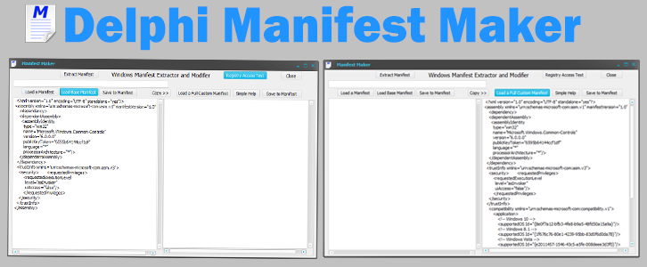

**Updating the Applications Manifest using an Older Delphi IDE**

If you are using the latest IDE (Integrated Development Environment) then you
will not have to use this option as the manifest is already up-to-date.

However if you are using an older IDE, you will quickly discover that a much
needed up-to-date manifest is needed to ensure that your Application will target
the latest Windows platform.

Here is a small Delphi Application including source for creating / comparing
manifests and a Windows 10 targeted custom manifest template. It also allows for
extracting any manifest from any .exe Windows application.

This will show the manifest for the File.

The base manifest allows for custom addition of XML and is the manifest that
tends to ship with the older IDE’s.

Opening the Custom Manifest includes full support for Windows 10 and is
backwards compatible.

Refer to
[MICROSOFT](https://msdn.microsoft.com/en-us/library/WINDOWS/DESKTOP/DN48124(V=VS.85).ASPX/)
for more information on more information about the manifest requirements or
checkout the embarcadero docwiki for more info.

Save this manifest into your project area and it will automatically select a
.manifest extension. Use a name that you will be able to identify.

How to Use the Manifest

Load your manifest into a XE3 IDE requires you to open Project Options. In the
Application section, select Custom Manifest from the drop down. Then load the
manifest from your path. This will be included in your Application exe when it
is compiled.

License
-------

This project is licensed under the MIT license agreement.

Permission is hereby granted, free of charge, to any person obtaining a copy of
this software and associated documentation files (the "Software"), to deal in
the Software without restriction, including without limitation the rights to
use, copy, modify, merge, publish, distribute, sublicense, and/or sell copies of
the Software, and to permit persons to whom the Software is furnished to do so,
subject to the following conditions: The above copyright notice and this
permission notice shall be included in all copies or substantial portions of the
Software.

THE SOFTWARE IS PROVIDED "AS IS", WITHOUT WARRANTY OF ANY KIND, EXPRESS OR
IMPLIED, INCLUDING BUT NOT LIMITED TO THE WARRANTIES OF MERCHANTABILITY, FITNESS
FOR A PARTICULAR PURPOSE AND NONINFRINGEMENT. IN NO EVENT SHALL THE AUTHORS OR
COPYRIGHT HOLDERS BE LIABLE FOR ANY CLAIM, DAMAGES OR OTHER LIABILITY, WHETHER
IN AN ACTION OF CONTRACT, TORT OR OTHERWISE, ARISING FROM, OUT OF OR IN
CONNECTION WITH THE SOFTWARE OR THE USE OR OTHER DEALINGS IN THE SOFTWARE.

Happy Coding

Greg
